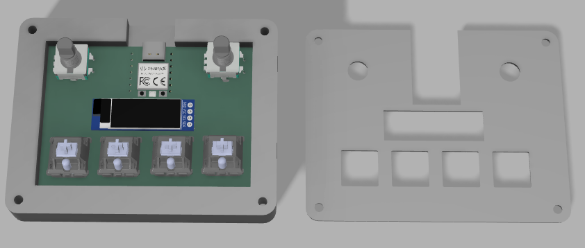
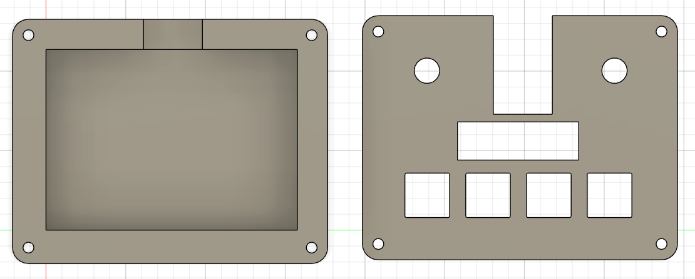
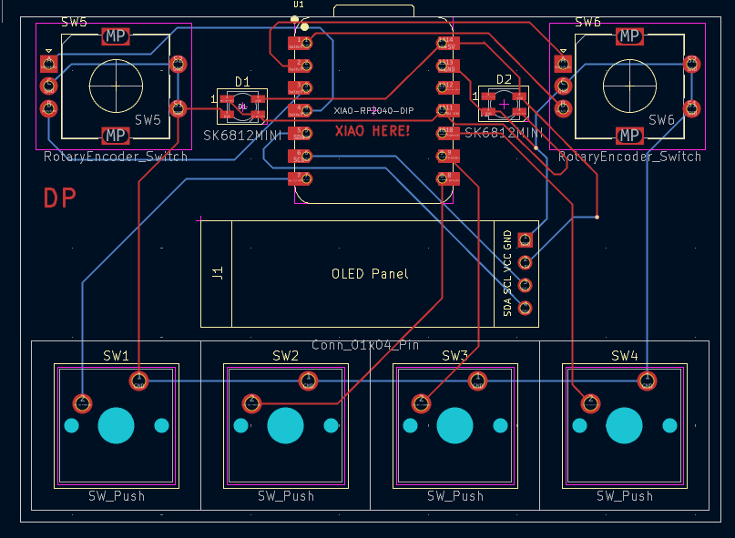
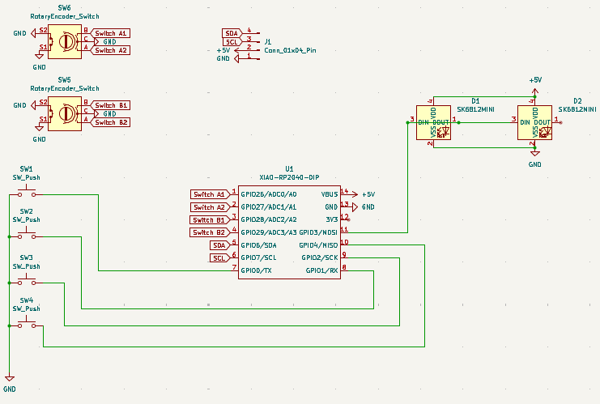
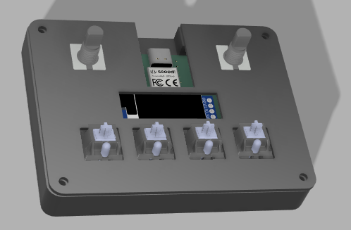

# DP's MacroPad

A custom 4-key macropad with 2 rotary encoders and an OLED display, powered by the Seeed XIAO RP2040. Designed with KiCad, Fusion360 and VsCode
## Bill of Materials (BOM)
* 1x Seeed XIAO RP2040
* 4x Cherry MX-style Switches
* 2x EC11 Rotary Encoders
* 1x 0.91" OLED Display (I2C)
* 2x SK6812 MINI-E LEDs
* 1x 3D Printed Case

## Project Gallery

### 1. The Case

*A view of the 3D printed enclosure designed in Fusion 360.*

### 2. The PCB

*The 2-layer PCB design created in KiCad, featuring the XIAO footprint and encoder placement.*

### 3. The Schematic

*The electrical connections showing the switch matrix and I2C connections.*

### 4. Assembly View

*How the PCB fits into the case.*
